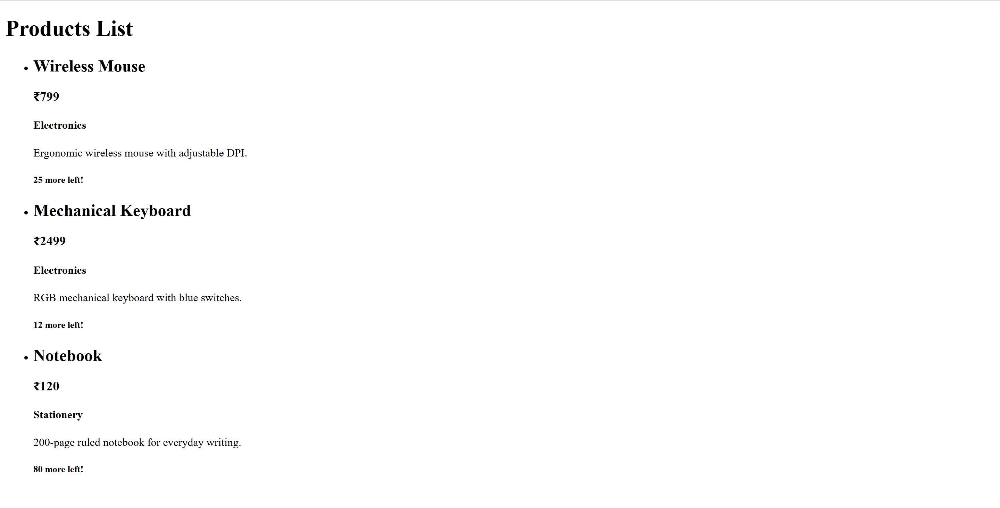
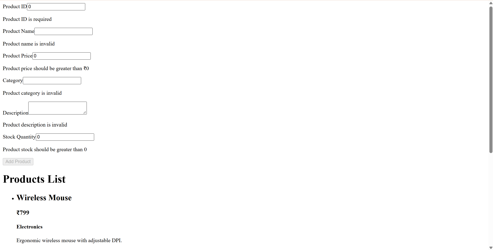
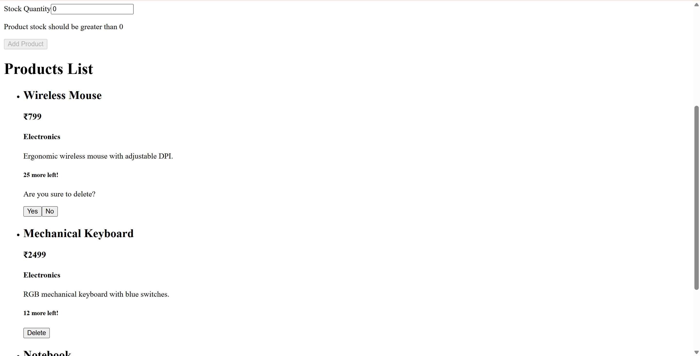
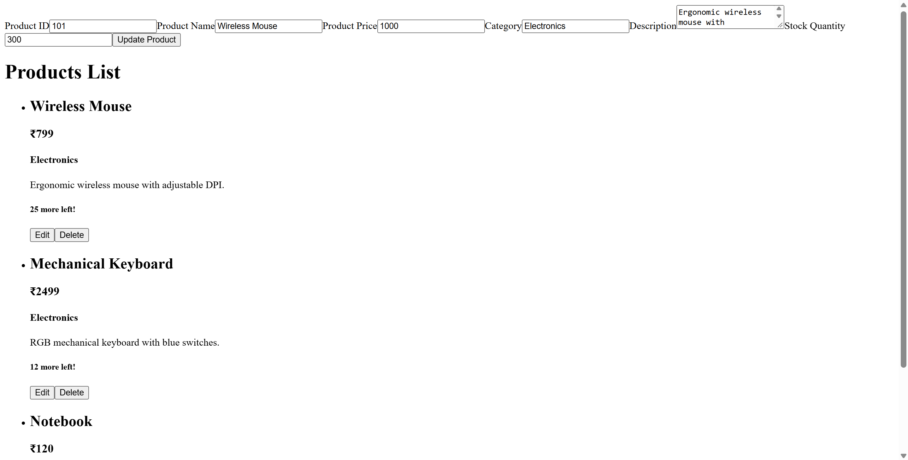
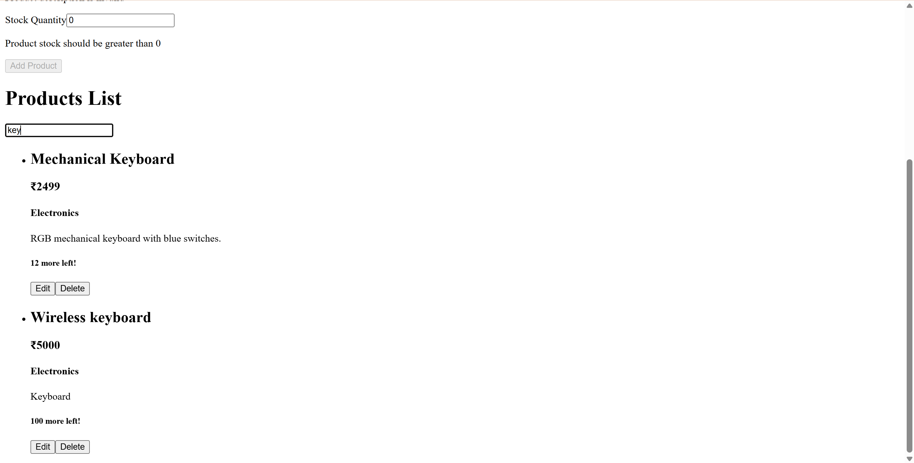
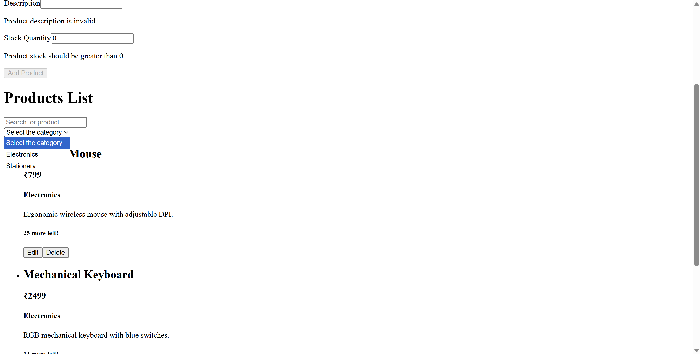

# Product Management App

A small CRUD app for products, built while learning React.

ChatGPT gave me the feature list, but I wrote all the code myself. No AI help, no copied tutorials, just trial and error.

I mainly wanted to get a feel for components, props, `useState`, `useContext`, controlled inputs, validation, and rendering lists with `map()` and `key`.

## Features

- Add a product: id, name, price, category, description, stock quantity
- Edit a product from the same form
- Delete a product, with a yes/no confirmation
- Search products by name as you type
- Filter by category, and clear the filter
- View one product in a details view
- Fields are validated as you type, and submit stays disabled until they're all valid
- Won't let you add a product with an id that already exists

The product id locks itself while editing so you can't change the id of a product that already
exists.

## Running it

```bash
npm install
npm run dev
```

Then open the address Vite prints, usually `http://localhost:5173`.

```bash
npm run build    # production build into dist/
npm run preview  # run the production build
npm run lint     # eslint
```

## Structure

```
src/
├── main.jsx              # mounts <App /> into #root
├── app/App.jsx           # holds the product list + form state, provides both contexts
├── context/              # ProductsContext, ProductFormContext
└── components/
    ├── ProductForm.jsx   # add + update, with validation
    ├── ProductList.jsx   # search, filter, and the list/details switch
    ├── ProductCard.jsx   # one product; also the details view
    ├── SearchBar.jsx
    └── ui/InputField.jsx # labelled input with an error slot
```

- `App` is the only place with shared state. The product list and the draft form live there and reach the other components through two contexts. Search text and the category filter stay local to `ProductList` since nothing else needs them.
- `ProductCard` renders both a list row and the details view, depending on whether `selectedProductId` is set. 
- `InputField` is the one piece I abstracted out, and every input in the app goes through it.

## How it went

One feature per day, committing after each so I could undo things when I broke them. Screenshots in `public/`.

**Day 1-2** — project setup and the product form with validation.




**Day 3-4** — delete with confirmation, then edit. Edit was what finally made context click for me:
clicking Edit just drops that product into the form state, and since the form is already on the page it fills up and switches to update mode. The `isExists` flag on each product is what tells the form which mode it's in.




**Day 5** — search, which is just `includes()` on a lowercased name, recomputed each render.



**Day 6** — category filter. The dropdown builds its own options from the products with
`Array.from(new Set(...))`, so a new category shows up on its own.



After that I added the details view and the duplicate id check.

## Rough edges

- Everything's in memory, so a reload wipes it. `localStorage` is next.
- No tests, no styling yet, no TypeScript or router. On purpose for now.

## Stack

React 19, Vite 8, plain JavaScript, ESLint. No other dependencies.
